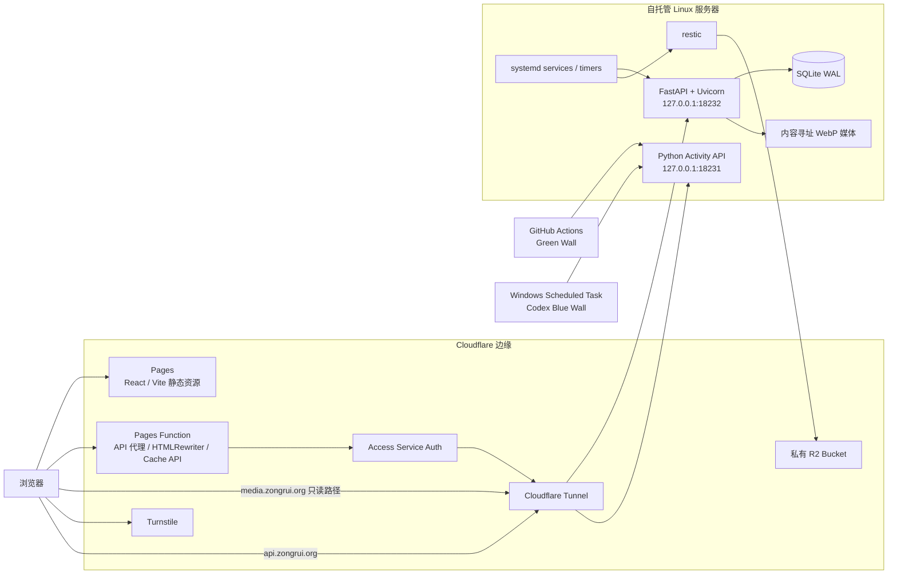

# zongrui.org

ZongRui 的个人网站，包含个人主页、技术作品、网页存档、GitHub/Codex 活动墙，以及一套自托管的完整博客系统。

- 主站：[https://zongrui.org](https://zongrui.org)
- 博客：[https://zongrui.org/articles](https://zongrui.org/articles)
- 博客管理后台：[https://zongrui.org/articles/console](https://zongrui.org/articles/console)

## 系统架构



网站不是 Next.js 或传统 SSR。公开页面主体是 React SPA；文章详情由 Cloudflare Pages Function 在边缘注入独立元数据、已清洗正文和首屏数据，因此分享爬虫与无 JavaScript 阅读器也能获得真实文章内容。

## 技术栈

### 前端

| 类别 | 技术与用途 |
| --- | --- |
| 语言 | TypeScript / TSX、原生 CSS、Cloudflare Worker JavaScript |
| UI | React 19.2.7、React DOM 19.2.7、React Hooks |
| 路由 | React Router DOM 7.18.1；`BrowserRouter`、`React.lazy` 与 `Suspense` 实现客户端路由和按页拆包 |
| 富文本编辑 | TipTap 3.28.0：Core、React、Starter Kit、Link、Placeholder、Underline，以及自定义 `figureImage` 节点 |
| 数据访问 | 浏览器原生 Fetch API；同源 `/api/articles/v1`；JSON、`FormData`、Cookie 与 CSRF 请求头 |
| 草稿与离线 | `localStorage`、3 秒空闲自动保存、离线草稿恢复、5 分钟自动修订检查点、revision 冲突提示 |
| 样式 | 手写 CSS、CSS Custom Properties、Grid、Flex、响应式媒体查询、可持久化的系统/浅色/深色三档主题与 `prefers-reduced-motion`；没有使用 Tailwind、Sass 或组件 UI 框架 |
| 字体 | `@fontsource-variable/jetbrains-mono` 5.2.8；本地托管 HarmonyOS Sans SC Bold |
| 静态媒体 | WebP、SVG、GIF；Vite 指纹资源使用一年 immutable 缓存 |
| 构建 | Vite 8.1.4、`@vitejs/plugin-react` 6.0.3、TypeScript 7.0.2 strict mode、ES2022、Lightning CSS 1.32.0 |
| 运行环境 | Node.js 22+、npm lockfile v3 |

TipTap 正文支持 H2/H3、粗体、斜体、下划线、删除线、引用、列表、链接、分隔线、代码块、带图注图片及撤销/重做。正文图片可上传或从媒体库复用，并保存 33/50/75/100% 宽度和起始/居中/末端对齐。H1 只用于文章标题，不允许在正文中重复出现。

### Cloudflare 边缘层

| 技术 | 用途 |
| --- | --- |
| Cloudflare Pages | 托管 Vite 的 `dist` 静态产物；生产分支为 `main` |
| Pages Functions / Workers Runtime | `functions/[[path]].js` 提供 Pages catch-all 适配，`functions/_worker.js` 实现完整边缘逻辑 |
| Workers Cache API | 缓存公开文章、标签、RSS 和 sitemap；源站短暂离线时提供 stale 副本 |
| HTMLRewriter | 注入 title、description、canonical、Open Graph、Twitter Card、RSS、Article JSON-LD、正文和首屏数据 |
| Cloudflare Access Service Auth | Pages Function 使用 service token 访问私有文章源站；浏览器不会接触 Access 凭据 |
| Cloudflare Tunnel | 将 loopback-only 的文章 API、只读媒体路径和活动墙 API 接入 Cloudflare |
| Cloudflare Turnstile | 匿名评论的人机验证；后端同时检查 token、hostname 和固定 action |
| Wrangler | `wrangler.jsonc` 定义 Pages 输出目录、兼容日期和非敏感源站地址 |

边缘缓存策略：

- 文章详情新鲜时间 5 分钟。
- 文章列表、标签、RSS 和 sitemap 新鲜时间 1 分钟。
- 搜索、筛选和 cursor 分页不进入 Cache API。
- 评论、鉴权、Console 和管理请求统一 `no-store`。
- 源站返回 `429` 或 `5xx` 时，公开内容最多可使用 7 天 stale 副本。
- 管理端写入后使用 `X-ZR-Cache-Invalidate` 定向失效文章、列表、标签、RSS 和 sitemap。
- 带 `Set-Cookie` 的响应自动降级为 `private, no-store`。

### 博客后端

| 类别 | 技术与用途 |
| --- | --- |
| 语言与运行时 | Python 3.12+；生产使用 Python 3.14；setuptools / wheel 构建 |
| Web 框架 | FastAPI、Uvicorn ASGI、Pydantic、pydantic-settings、python-multipart |
| 数据层 | SQLAlchemy 2 ORM、SQLite、Alembic 迁移 |
| SQLite 配置 | WAL、外键约束、`synchronous=NORMAL`、5 秒 busy timeout |
| HTTP 客户端 | HTTPX，用于 GitHub OAuth 与 Turnstile 服务端验证 |
| 富文本安全 | TipTap JSON 节点/mark 白名单、Bleach HTML 二次清洗、纯文本提取与中英文阅读时间计算 |
| 图片管线 | Pillow；JPEG/PNG/WebP 验证、EXIF 方向处理、最长边缩至 2000px、去元数据、统一转 WebP |
| 媒体存储 | SHA-256 内容寻址、去重、原子写入；本地媒体为主数据，R2 仅用于灾备 |
| 鉴权 | GitHub OAuth 2.0；以稳定的 GitHub 数字用户 ID 限定单一管理员 |
| 会话 | 服务端随机令牌摘要；`Secure`、`HttpOnly`、`SameSite=Lax` Cookie；默认 7 天有效 |
| 写操作保护 | CSRF token、revision + ETag 乐观并发控制、冲突返回 HTTP 409 |
| 评论防滥用 | Turnstile、每日轮换 HMAC 来源摘要、10 分钟 5 条与每天 30 条限流；不存储原始 IP |
| 公共输出 | cursor 分页、中文子串搜索、标签、归档、RSS、动态 sitemap、旧 slug 308 重定向 |

主要数据模型包括：`Article`、`ArticleRevision`、`Tag`、`ArticleTag`、`SlugRedirect`、`Comment`、`Media`、`AdminSession`、`OAuthState` 与不记录正文的 `AuditLog`。

文章支持草稿、定时发布、已发布和归档状态；支持题图、摘要、标签、可编辑 slug、发布/撤回、修订恢复和一级评论。每篇文章可独立选择大陆横排或右至左的繁中直排，排版模式会进入修订历史，但不会自动转换正文文字。评论只按纯文本显示，可隐藏、恢复或软删除。

### 活动墙后端

活动墙与博客是两个独立服务，不共享端口、依赖或状态。

| 类别 | 技术与用途 |
| --- | --- |
| 服务端 | Python 3.14 标准库，无第三方依赖；`ThreadingHTTPServer` / `BaseHTTPRequestHandler` |
| 存储 | GitHub Green Wall 与 Codex Blue Wall 分别保存为严格校验的 JSON；`fsync` + 原子替换，不使用数据库 |
| API 安全 | Bearer Token、固定 CORS 来源、请求体上限、严格 schema 重建 |
| 公共读取 | ETag、60 秒浏览器缓存、stale 策略 |
| GitHub 同步 | GitHub Actions、GitHub GraphQL API、GitHub CLI、`jq`、`curl`；每 6 小时同步一次 |
| Codex 同步 | Python JSONL 流式扫描器，仅聚合最近 365 天 turns、tokens 与 active days |
| Windows 上传 | PowerShell、DPAPI 保护的 `token.clixml`、Windows Scheduled Task；通过内网定时同步 |

Codex 数据导出器不会输出消息正文、图片、工具参数、响应内容或文件内容。

### 服务端与运维

| 技术 | 用途 |
| --- | --- |
| Linux + systemd | 运行博客、活动墙、定时发布、备份和恢复检查 |
| systemd timers | 每分钟检查定时发布；每日夜间备份；每月恢复演练 |
| systemd hardening | `NoNewPrivileges`、`ProtectSystem=strict`、`PrivateTmp`、`PrivateDevices`、空 capability set、namespace/syscall 限制 |
| UFW | 博客端口不对公网放行；活动墙的 Windows 上传只使用来源和目标均受限的 LAN 规则 |
| restic | 对数据库快照和媒体文件进行去重、增量、加密备份 |
| Cloudflare R2 | 私有 S3 兼容备份仓库 `zongrui-articles-backup` |
| `flock` | 串行化媒体写入、备份和 restic 操作，避免数据库与文件快照不一致 |
| SQLite online backup API | 在不停服的情况下生成一致性数据库快照 |
| Git / GitHub | 源码托管、Pull Request、活动墙同步工作流；Pages 部署由 Cloudflare 完成，不由 GitHub Actions 执行 |

restic 保留 14 个日备份、8 个周备份和 12 个月备份。月度恢复任务会恢复最新快照到临时目录，执行 SQLite `integrity_check`，检查表结构，并核对每个媒体文件的 SHA-256。

### HTTP 与应用安全

- nonce 化 Content Security Policy、HSTS、`nosniff`、`X-Frame-Options: DENY`、`frame-ancestors 'none'`。
- `Referrer-Policy: strict-origin-when-cross-origin` 与禁用摄像头、麦克风、定位的 Permissions Policy。
- Pages Function 删除访客伪造的 Access、Forwarded、来源 IP 和共享密钥头，再添加可信转发信息。
- 源站响应移除 `Server`、`X-Powered-By` 及内部 `CF_Authorization` Cookie。
- 文章 API 不提供 CORS；浏览器统一调用同源 `/api/articles/*`。
- `media.zongrui.org` 仅允许内容寻址的 `/media/YYYY/MM/<sha256>.webp` 路径以及 `GET` / `HEAD`。
- 图片仅接受 JPEG、PNG、WebP；SVG、原始 HTML、任意附件和嵌套评论会被拒绝。
- 密钥只保存在 Cloudflare encrypted secrets 或服务器 root-owned 环境文件中，不进入 Git。

## 请求与数据路径

| 入口 | 处理链路 |
| --- | --- |
| `/`、普通静态资源 | 浏览器 → Cloudflare Pages |
| `/articles`、`/articles/:slug` | 浏览器 → Pages Function → 边缘 HTML 注入；公开数据来自文章 API |
| `/api/articles/*` | 浏览器 → Pages Function → Access service token → Tunnel → FastAPI |
| `media.zongrui.org/media/*` | 浏览器 → Tunnel 路径白名单 → FastAPI 只读媒体处理 |
| `api.zongrui.org` | 浏览器/同步任务 → Tunnel → Activity API |
| 博客备份 | systemd timer → SQLite 一致性快照 + media → restic → 私有 R2 |

博客服务默认只监听 `127.0.0.1:18232`，活动墙默认监听 `127.0.0.1:18231`。两个服务都通过 Cloudflare Tunnel 对外提供受限入口，而不是直接开放服务器端口。

## 目录结构

```text
.
├─ src/                         React 前端、文章页面、Console 与活动墙组件
├─ functions/                   Cloudflare Pages Function / Worker 边缘逻辑
├─ public/                      字体、图片、静态安全头和 Pages 路由配置
├─ articles-backend/            FastAPI 博客服务、Alembic、测试与 systemd 单元
├─ backend/                     零依赖 Activity API 与 systemd 单元
├─ scripts/                     Codex 聚合导出和 Windows 同步脚本
├─ docs/                        边缘层部署说明
├─ .github/workflows/           GitHub Green Wall 定时同步
├─ package.json                 前端依赖与构建脚本
└─ wrangler.jsonc               Cloudflare Pages / Wrangler 配置
```

## 本地开发

### 前端

```bash
npm ci
npm run dev
```

生产构建与本地预览：

```bash
npm run build
npm run preview
```

本地运行 Pages Function：

```bash
npm run build
npx wrangler pages dev dist
```

将 `.dev.vars.example` 复制为未跟踪的 `.dev.vars`，再配置本地文章源站。不要把 Access、OAuth、Turnstile、R2 或共享源站密钥提交到仓库。

### 博客后端

```bash
cd articles-backend
python3 -m venv .venv
.venv/bin/pip install -e '.[test]'
cp .env.example .env
.venv/bin/alembic upgrade head
.venv/bin/python -m app.seed
.venv/bin/python -m app.server
```

种子命令是幂等的，只创建一篇未发布的“关于我”草稿。完整部署、Tunnel、Access、R2 与回滚说明见 [`articles-backend/README.md`](articles-backend/README.md) 和 [`docs/articles-edge.md`](docs/articles-edge.md)。

## 验证与质量工具

前端与边缘层：

```bash
npm run typecheck
npm run build
node --check functions/_worker.js
npx wrangler pages functions build
```

博客后端：

```bash
cd articles-backend
.venv/bin/pytest
.venv/bin/ruff check app tests
.venv/bin/alembic check
```

后端当前有 17 项 pytest 测试，覆盖文章状态、搜索、ETag、revision 冲突、修订恢复、slug 重定向、横排/直排、富文本限制、OAuth、CSRF、Turnstile、评论限流与审核、图片重编码和排版、定时发布与种子数据。`pytest-cov` 用于覆盖率检查，Ruff 用于 Python 静态检查。

当前没有引入 ESLint、Prettier、Vitest/Jest 或 Playwright/Cypress；前端质量门槛由 TypeScript strict typecheck、Vite 生产构建和实际浏览器验收组成。

## 部署边界

| 组件 | 位置 | 状态边界 |
| --- | --- | --- |
| 主站与博客前端 | Cloudflare Pages | 无持久状态；构建产物来自 `main` |
| Pages Function | Cloudflare Workers Runtime | 无持久主数据；只使用边缘缓存 |
| 博客 API | 自托管 Linux，`127.0.0.1:18232` | `/var/lib/zongrui-articles/articles.db` 与 `media/` |
| 活动墙 API | 自托管 Linux，`127.0.0.1:18231` | 两个原子 JSON 状态文件 |
| 博客媒体 | 服务器本地为主 | 通过 `media.zongrui.org` 只读提供 |
| 灾备 | 私有 Cloudflare R2 | restic 加密快照，不作为在线主存储 |

博客、活动墙和 Cloudflare Pages 可以分别回滚。博客部署和回滚不得停止活动墙服务或修改其 `18231` 端口及状态。

## 内容与隐私说明

网站文案来自公开项目资料与用户明确授权的 ChatGPT 账号记忆摘要，并经过隐私筛查。仓库不保存 ChatGPT 对话、学校信息或其他私密资料；只公开用户明确指定的社交链接。

评论仅保存昵称和正文；不收集邮箱或网址。活动墙只保存按天聚合的贡献、turn 和 token 统计，不保存 Codex 对话正文。

## 公开入口

- [GitHub](https://github.com/zongruichd)
- [ZongTech](https://zongtech.xyz)
- [2022314](https://2022314.xyz)
- [Telegram](https://t.me/zongruichd)
- [X](https://x.com/zongruichd)
